# Data Model — PrajaShakti Issue Engine

Full entity-relationship diagram of the current schema (Sprint 2, Day 22).
All tables are in PostgreSQL; geo extensions provided by PostGIS.

---

## ER Diagram (Mermaid)

```mermaid
erDiagram
    %% ─── Identity ────────────────────────────────────────────────────────────
    users {
        uuid   id            PK
        varchar phone         UK "10 digits"
        varchar name
        varchar email         UK "nullable"
        varchar bio           "500 chars"
        text    avatar_url
        decimal location_lat
        decimal location_lng
        varchar district
        varchar state
        varchar pincode
        varchar role          "citizen|verified_citizen|leader|moderator|official|admin"
        int     reputation_score "default 0"
        boolean is_active     "default true"
        boolean is_verified   "Aadhaar link; drives support weight"
        varchar google_id     "nullable — OAuth"
        varchar aadhaar_hash  "nullable — Sprint 3"
        timestamptz last_login_at
        timestamptz created_at
        timestamptz updated_at
    }

    %% ─── Government Taxonomy ─────────────────────────────────────────────────
    ministries {
        uuid    id           PK
        varchar code         UK "e.g. MHA, PWD-DL"
        varchar name
        varchar type         "central|state|ut"
        varchar state_code   "nullable — for state ministries"
        text    website
        varchar cpgrams_code "Phase 2 CPGRAMS routing"
        boolean is_active
        timestamptz created_at
        timestamptz updated_at
    }

    departments {
        uuid    id           PK
        varchar code         UK
        varchar name
        uuid    ministry_id  FK
        varchar cpgrams_code
        boolean is_active
        timestamptz created_at
        timestamptz updated_at
    }

    grievance_categories {
        uuid    id                    PK
        varchar slug                  UK
        varchar praja_category        "Human-readable"
        varchar cpgrams_category_code "CPGRAMS routing code"
        uuid    default_department_id FK "nullable"
        text_array keywords           "keyword matching array"
        boolean is_active
        timestamptz created_at
        timestamptz updated_at
    }

    %% ─── Location Lookup ─────────────────────────────────────────────────────
    states {
        uuid    id         PK
        varchar code       UK "e.g. DL, MH, PB"
        varchar name
        varchar type       "state|ut"
        varchar lgd_code   "LGD bridge for CPGRAMS"
        boolean is_active
        timestamptz created_at
    }

    districts {
        uuid    id         PK
        varchar code       "e.g. DL11"
        varchar name
        uuid    state_id   FK
        varchar lgd_code
        boolean is_active
        timestamptz created_at
    }

    %% ─── Officials ───────────────────────────────────────────────────────────
    officials {
        uuid    id                       PK
        varchar name
        varchar designation
        uuid    department_id            FK "nullable"
        uuid    ministry_id              FK "nullable"
        varchar jurisdiction_type        "national|state|district|municipal|local"
        varchar jurisdiction_code
        varchar state_code
        varchar district_code
        varchar public_email
        varchar public_phone
        text    office_address
        varchar twitter_handle
        int     total_issues_tagged      "incremented on tag"
        int     total_issues_resolved    "Phase 2 Sprint 10"
        decimal avg_resolution_days      "Phase 2 Sprint 10"
        decimal citizen_satisfaction_score "Phase 2 Sprint 11"
        decimal discrepancy_score        "Phase 2 Sprint 11"
        varchar cadre                    "IAS|IPS|IFS|PCS etc."
        int     batch_year
        varchar source                   "manual|seed|api"
        boolean is_verified
        uuid    claimed_by_user_id       FK "nullable — Phase 3"
        timestamptz claimed_at
        timestamptz created_at
        timestamptz updated_at
    }

    %% ─── Issues (core entity) ────────────────────────────────────────────────
    issues {
        uuid    id                    PK
        varchar title                 "10–200 chars"
        text    description           "max 2000 chars"
        varchar category              "Infrastructure|Healthcare|Education|Safety|Environment|Agriculture|Corruption|Other"
        varchar urgency               "critical|high|medium|low"

        uuid    ministry_id           FK "nullable — user or NLP"
        uuid    department_id         FK "nullable — user or NLP"
        uuid    grievance_category_id FK "nullable — user or NLP"

        varchar official_name         "free-text (legacy)"
        varchar official_designation
        varchar official_department

        decimal location_lat          "NOT NULL"
        decimal location_lng          "NOT NULL"
        varchar district
        varchar state
        varchar pincode
        text    formatted_address
        jsonb   photos                "array of {url, caption, uploadedAt, isVerifiedLocation, distanceMeters}"

        varchar status                "active|trending|escalated|officially_resolved|citizen_verified_resolved|citizen_disputed|closed"
        int     supporter_count       "denormalized — Redis is hot path"
        int     comment_count         "denormalized"
        int     share_count           "denormalized"
        int     view_count            "incremented on GET /issues/:id"

        boolean is_campaign
        int     target_supporters
        timestamptz campaign_deadline
        int     escalation_level      "0–5"
        timestamptz escalated_at

        jsonb   tracking_ids          "CPGRAMS / state / RTI / NCH tracking refs"
        timestamptz resolved_at
        text    resolution_notes
        decimal discrepancy_score     "Phase 2 Sprint 11 — 0.0–1.0"

        uuid    created_by            FK "NOT NULL"
        boolean is_anonymous
        boolean is_verified_location  "set when EXIF GPS matches issue location"

        timestamptz created_at
        timestamptz updated_at
    }

    %% ─── Issue–Official Many-to-Many ─────────────────────────────────────────
    issue_officials {
        uuid    issue_id    FK "PK part"
        uuid    official_id FK "PK part"
        uuid    tagged_by   FK "nullable"
        varchar tag_type    "primary|escalation|mentioned|claimed"
        timestamptz tagged_at
    }

    %% ─── Supports ────────────────────────────────────────────────────────────
    supports {
        uuid    user_id          FK "PK part"
        uuid    issue_id         FK "PK part"
        decimal weight           "0.3–1.5; computed by supportWeight.js"
        varchar source           "web|mobile|api|imported"
        varchar ip_hash          "SHA-256 truncated — anti-gaming"
        varchar user_agent_hash  "SHA-256 truncated — anti-gaming"
        timestamptz created_at
    }

    %% ─── Comments ────────────────────────────────────────────────────────────
    comments {
        uuid    id           PK
        uuid    issue_id     FK
        uuid    user_id      FK
        uuid    parent_id    FK "nullable — thread replies"
        text    body         "max 1000 chars"
        int     upvote_count
        boolean is_deleted   "soft delete"
        timestamptz created_at
        timestamptz updated_at
    }

    %% ─── Anti-Gaming ─────────────────────────────────────────────────────────
    suspicious_activity {
        uuid    id           PK
        varchar event_type   "velocity_spike|ip_concentration|ua_concentration"
        varchar entity_type  "issue|user"
        uuid    entity_id
        varchar severity     "info|warning|critical"
        jsonb   details      "check details"
        boolean reviewed     "default false"
        uuid    reviewed_by  FK "nullable"
        timestamptz reviewed_at
        timestamptz created_at
    }

    %% ─── Notifications ───────────────────────────────────────────────────────
    notifications {
        uuid    id         PK
        uuid    user_id    FK
        varchar type       "milestone|trending|official_response etc."
        varchar title
        text    body
        text    action_url
        boolean is_read    "default false"
        jsonb   metadata
        timestamptz created_at
    }

    %% ─── Audit & Activity ────────────────────────────────────────────────────
    user_activity {
        uuid    id           PK
        uuid    user_id      FK
        varchar action       "register|login|create_issue|support etc."
        varchar entity_type
        uuid    entity_id
        jsonb   metadata
        varchar ip_address
        text    user_agent
        timestamptz created_at
    }

    audit_log {
        uuid    id           PK
        uuid    user_id      FK "nullable — system events"
        varchar action
        varchar entity_type
        uuid    entity_id
        jsonb   old_values   "before state"
        jsonb   new_values   "after state"
        varchar ip_address
        timestamptz created_at
    }

    %% ─── Relationships ───────────────────────────────────────────────────────
    ministries         ||--o{ departments          : "has"
    ministries         ||--o{ officials             : "oversees"
    ministries         ||--o{ issues                : "tagged_to"

    departments        ||--o{ grievance_categories  : "default_for"
    departments        ||--o{ officials             : "employs"
    departments        ||--o{ issues                : "tagged_to"

    grievance_categories ||--o{ issues              : "classifies"

    states             ||--o{ districts             : "contains"

    users              ||--o{ issues                : "creates"
    users              ||--o{ supports              : "gives"
    users              ||--o{ comments              : "writes"
    users              ||--o{ notifications         : "receives"
    users              ||--o{ user_activity         : "logs"
    users              ||--o{ audit_log             : "audited_in"
    users              }o--o{ officials             : "claims (Phase 3)"

    issues             ||--o{ supports              : "receives"
    issues             ||--o{ comments              : "has"
    issues             ||--o{ issue_officials       : "tags"
    issues             ||--o{ notifications         : "triggers"

    officials          ||--o{ issue_officials       : "tagged_in"

    suspicious_activity }o--|| users               : "reviewed_by"
```



---

## Table Summary

| Table                  | Rows (seeded)        | Purpose                           |
| ---------------------- | -------------------- | --------------------------------- |
| `users`                | 0 (auth creates)     | Identity, roles, reputation       |
| `ministries`           | ~97                  | Central + State + UT ministries   |
| `departments`          | ~167                 | Service delivery units            |
| `grievance_categories` | ~75                  | CPGRAMS taxonomy leaf nodes       |
| `states`               | 36                   | States + UTs lookup               |
| `districts`            | ~766                 | District lookup, LGD codes        |
| `officials`            | 0 (seeded by script) | Bureaucrat/politician profiles    |
| `issues`               | 0 (user creates)     | Core citizen grievance entity     |
| `issue_officials`      | 0                    | Issue ↔ official many-to-many     |
| `supports`             | 0                    | Citizens backing an issue         |
| `comments`             | 0                    | Discussion threads                |
| `suspicious_activity`  | 0                    | Anti-gaming flags                 |
| `notifications`        | 0                    | Per-user inbox (Phase 2 Sprint 5) |
| `user_activity`        | 0                    | User action log                   |
| `audit_log`            | 0                    | Admin audit trail                 |

---

## Key Design Decisions

### JSONB Fields

| Field                       | Table               | Rationale                                                                                      |
| --------------------------- | ------------------- | ---------------------------------------------------------------------------------------------- |
| `tracking_ids`              | issues              | Schema-free external refs — CPGRAMS/RTI/NCH IDs vary per portal; GIN-indexed for `@>` queries  |
| `photos`                    | issues              | Photo array with per-photo metadata (EXIF verification result, distance); avoids JOIN overhead |
| `details`                   | suspicious_activity | Anti-gaming check results vary per check type                                                  |
| `metadata`                  | notifications       | Type-specific payload without schema migration                                                 |
| `old_values` / `new_values` | audit_log           | Full change capture without EAV tables                                                         |

### Denormalized Counters

`issues.supporter_count`, `comment_count`, `share_count`, `view_count` are updated in-place (atomic `UPDATE issues SET supporter_count = supporter_count + 1`). Redis holds the hot counter for `supporter_count`; a 10-minute reconciliation cron corrects drift. This avoids a `COUNT(*)` join on every feed read.

### Nullable Government Taxonomy

`issues.ministry_id`, `department_id`, `grievance_category_id` are all nullable FKs. Phase 1 fills them via user dropdown or keyword-based tag suggestion. Phase 2 Sprint 9 adds NLP auto-fill with `WHERE grievance_category_id IS NULL` guard so it never overwrites user intent.

### Support Weight

`supports.weight` is a `DECIMAL(3,2)` computed at INSERT time by `computeSupportWeight()`. It is never recalculated (historical immutability). Phase 2 Sprint 11 can adjust via a `discrepancy_modifier` applied when scoring, not by mutating existing rows.

### Status Machine

```
active ──────────────────────────────────────── trending (≥ 100 supporters, auto)
  │                                                 │
  └───────── escalated ──── officially_resolved ────┘
  │              ▲                   │
  │         Phase 2 Sprint 8         └─ citizen_disputed (within 30 days)
  │
  └─── citizen_verified_resolved (citizen marks done)
  │
  └─── closed (soft delete)
```

---

## Indexes Summary

### Composite / Partial Indexes (added Day 22)

| Index                               | Columns                                      | Partial?             | Covers                 |
| ----------------------------------- | -------------------------------------------- | -------------------- | ---------------------- |
| `idx_issues_status_cat_created`     | `(status, category, created_at DESC)`        | `status != 'closed'` | Category-filtered feed |
| `idx_issues_status_urgency_created` | `(status, urgency, created_at DESC)`         | `status != 'closed'` | Urgency-filtered feed  |
| `idx_issues_district_state_created` | `(district, state, status, created_at DESC)` | `status != 'closed'` | Geo-filtered feed      |
| `idx_issues_supporter_created`      | `(supporter_count DESC, created_at DESC)`    | `status != 'closed'` | Trending sort          |
| `idx_supports_issue_created`        | `(issue_id, created_at DESC)`                | —                    | 24h velocity query     |

### Full-Text / GIN Indexes

| Index                      | Method         | Covers                    |
| -------------------------- | -------------- | ------------------------- |
| `idx_officials_name_trgm`  | GIN (pg_trgm)  | Fuzzy name search         |
| `idx_officials_desig_trgm` | GIN (pg_trgm)  | Fuzzy designation search  |
| `idx_issues_tracking_ids`  | GIN            | JSONB `@>` containment    |
| `idx_districts_name`       | GIN (tsvector) | Full-text district lookup |

### PostGIS Index (added Day 19)

| Index             | Method | Covers                                             |
| ----------------- | ------ | -------------------------------------------------- |
| `idx_issues_geom` | GiST   | `ST_DWithin` (nearby) and `ST_MakeEnvelope` (bbox) |
